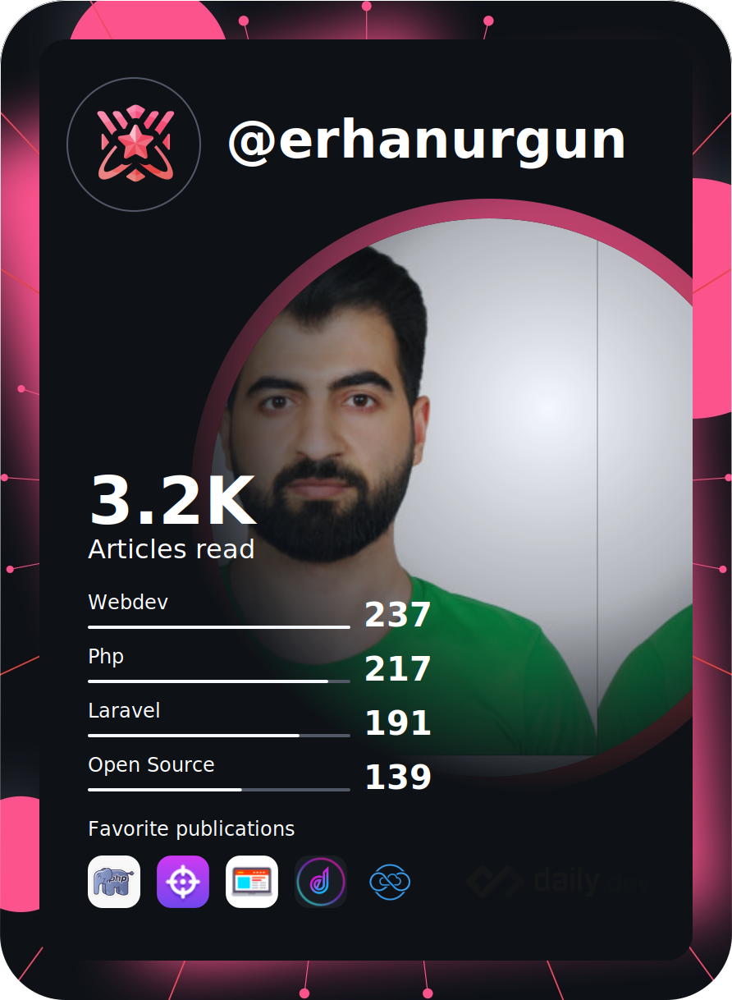

<div id="badges" align="center">
  <a href="https://www.linkedin.com/in/erhanurgun/" target="_blank">
    
  </a>
  <a href="https://www.youtube.com/channel/UCsT0QNcU4scQILX8tcYVg2w?sub_confirmation=1" target="_blank">
    
  </a>
  <a href="https://twitter.com/erhanurgun" target="_blank">
    
  </a>
  <a href="https://www.instagram.com/erhanurgunn/" target="_blank">
    
  </a>
  <a href="https://www.facebook.com/erhanurgunn" target="_blank">
    
  </a>
</div>

<hr>

<div id="message" align="center">
    <a href="https://git.io/typing-svg" target="_blank">
        
    </a>
</div>

<div id="images">
  <a href="https://erhanurgun.com.tr" target="_blank">
    
  </a>
</div>

### :man_technologist: Hakkımda Kısaca

```js
import Developer from 'Orizora';
import {
    Language, Database, Framework, FrontendTool,
    Api, Server, DevOps, Caching, Mobile, Game, Desktop, 
    Principle, Methodology, SearchEngine, Cloud, Other
} from 'Orizora/Skills';

class Bio extends Developer {
    name     = 'Erhan ÜRGÜN';
    role     = 'Back-End Developer';
    email    = 'erho.dev@gmail.com';
    websites = [
        { name: 'Portfolio', url: 'https://erhanurgun.tr' },
        // { name: 'Company', url: 'https://orizora.com' },
        { name: 'Blog', url: 'https://erho.dev' },
        { name: 'Bağlantılarım',  url: 'https://erho.me' },
        { name: 'LinkTree',  url: 'https://linktr.ee/erhanurgun' },
    ];
    socials  = [
        // { name: 'YouTube', url: 'https://youtube.com/@erho_dev' },
        { name: 'LinkedIn', url: 'https://linkedin.com/in/erhanurgun' },
        { name: 'Instagram', url: 'https://instagram.com/erho.dev' },
        { name: 'Twitter',  url: 'https://twitter.com/erhanurgun' }
    ];
}

class Skills extends Developer {
    languages     = ['PHP', 'NodeJS', 'JavaScript', /*'Python', 'C#',*/ ...Language];
    databases     = ['MySQL', 'MsSQL', 'SQLite', /*'PostgreSQL', 'MongoDB',*/ ...Database];
    frameworks    = ['Laravel', 'AdonisJS', 'Livewire', /*'Django',*/ ...Framework];
    frontendTools = ['TailwindCSS', 'Bootstrap', /*'React', 'AlpineJS', 'Bulma', 'SASS',*/ ...FrontendTool]; 
    api           = ['RESTful API', /*'GraphQL', 'gRPC',*/ ...Api];
    server        = ['Apache', 'Nginx', /*'RabbitMQ',*/ ...Server];
    devOps        = ['Docker', /*'Jenkins', 'CI/CD', 'Kubernetes',*/ ...DevOps];
    // caching    = ['Redis', 'Memcached', ...Caching];
    // mobile     = ['React Native', 'Flutter', ...Mobile];
    // games      = ['Unity', 'Unreal Engine', ...Game];
    // desktop    = ['ElectronJS', ...Desktop];
    principles    = ['SOLID', 'DRY', 'SRP', /*'TDD',*/ ...Principle];
    methodologies = ['Kanban', 'Gantt', /*'Scrum', 'Agile',*/ ...Methodology];
    searchEngines = [/*'Elasticsearch', 'Algolia',*/ ...SearchEngine];
    clouds        = ['Hetzner Cloud', /*'AWS', 'Google Cloud', 'MS Azure', 'DigitalOcean',*/ ...Cloud];
    others        = ['AI', 'Git', 'Linux', 'cPanel', 'Plesk', 'Cloudflare', /*'Firebase',*/ ...Other];
}

export default () => new Developer(new Bio(), new Skills());
```

### :fire: İstatistiklerim

<div id="github_stats" align="center">

<!--  -->


[](https://roadmap.sh)

[](https://leetcode.com/u/erhanurgun)

[](https://git.io/streak-stats)

<a href="https://app.daily.dev/erhanurgun" target="_blank">
  
</a><br><br>

<!-- 
<a href="https://codersclub.co/tr/dev/erhanurgun" target="_blank">
  
</a><br><br> 

<a href="https://app.daily.dev/erhanurgun" target="_blank">
  
</a><br><br>

<a href="https://app.daily.dev/erhanurgun" target="_blank">
  
</a><br><br>

<a href="https://app.daily.dev/erhanurgun" target="_blank">
  
</a><br><br>

<a href="https://app.daily.dev/erhanurgun" target="_blank">
  
</a><br><br>
-->

<a href="https://www.codewars.com/users/erhanurgun" target="_blank">
  
</a><br><br>

[](https://github.com/anuraghazra/github-readme-stats)

<a href="https://leetcode.com/erhanurgun" target="_blank">
  
</a><br><br>

<a href="https://tr.liberapay.com/erhanurgun" target="_blank">
  
</a><br><br>


<br><br>

</div>

<!-- https://animatedimages.org -->
<div align="center">


<!--  -->

<!--  -->

</div>

<hr>

<div id="badges">
  + Hakkımdaki detaylar zamanla güncellenecektir...
  <br>
  + Daha fazla bilgi için
  <a href="https://erho.me" target="_blank" title="Links">erho.me</a>'den veya
  <a href="https://erho.social" target="_blank" title="Links">erho.social</a>'dan
  bütün bağlantılarıma ulaşabilirsiniz...
</div>
